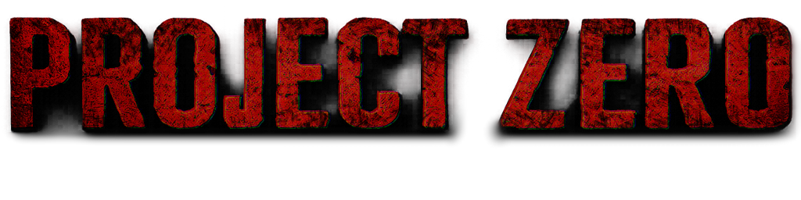

## About

Project Zero is a zombie apocalypse modpack built around scavenging, survival, exploration, and fighting against overwhelming undead hordes. Civilization has collapsed, resources are scarce, and every day is a battle to stay alive. Explore a dangerous and unforgiving world, search for supplies, establish safe havens, avoid infection, and uncover the remnants of what came before. This modpack is the result of over 200 hours of planning, testing, and refinement. This includes extensive work on shader modifications, the resource pack, mod selection, configuration files, world generation, balance adjustments, and the overall gameplay experience. The goal from the very start has been to create a polished zombie apocalypse experience where every system works together to support survival, exploration, challenges, and a beautiful atmosphere.

## Features

* Dangerous hordes and enhanced enemy AI behavior.
* Enemies that can hear and see you from far away.
* Expanded exploration with custom structures, loot, and world generation.
* Fight for your life oriented progression and resource mechanics.
* Dynamic seasons, weather, and environmental challenges.
* Enhanced atmosphere through darkness, fog, ambient audio, and realistic sound propagation.
* Custom hunger, thirst, and temperature mechanics per biome.
* Multiplayer is supported without changing mods or configs.

## Survival Tips

* Avoid unnecessary fights early game.
* Find a secure shelter before night.
* Never underestimate a horde.

## Recommended PC Specs

* 8 GB RAM Minimum
* 12-16 GB RAM Recommended

## Installation

1. Download the latest release.
2. Drag the downloaded .zip folder to Prism Launcher.
3. Hit play and try to survive.

## Credits

Project Zero would not exist without the amazing work of the Minecraft modding community and the developers whose projects helped shape this modpack.

### Resource Packs

Project Zero includes assets and inspiration from the work of:

* Usaki
* RedXuchilbara
* Satellence

Thank you for creating resources that helped make Project Zero what it is today.

### Shaders

Project Zero incorporates the beautiful assets from:

* Insanity Shaders — ElocinDev
* BSL Shaders — Capt Tatsu

Thank you for creating and sharing the work that served as the foundation for Project Zero Shaders.

### Mod Developers

Project Zero includes the work of many talented mod developers from across the Minecraft community. Thank you to everyone who creates, maintains, and supports the mods that make this project possible. Credits for included mods can be viewed in the mod list after importing the pack into Prism Launcher.

## Contact

Questions, feedback, bug reports, or credit related concerns can be directly sent to me through any of the following:

* Email: [moon.skailer@dragex.dev](mailto:moon.skailer@dragex.dev)
* Discord: @skailermoon
* Telegram: @skailermoon
