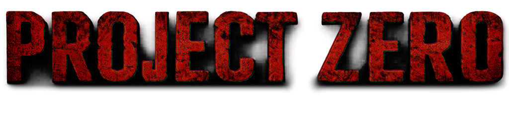

## About

Project Zero is a zombie apocalypse modpack built around scavenging, survival, exploration, and fighting against overwhelming undead hordes. Civilization has collapsed, resources are scarce, and every day is a battle to stay alive. Explore a dangerous and unforgiving world, search for supplies, establish safe havens, avoid infection, and uncover the remnants of what came before. This modpack is the result of over 200 hours of planning, testing, and refinement. This includes extensive work on shader modifications, the resource pack, mod selection, configuration files, world generation, balance adjustments, and the overall gameplay experience. The goal from the very start has been to create a polished zombie apocalypse experience where every system works together to support survival, exploration, challenges, and a beautiful atmosphere.

## Features

- Dangerous hordes and enhanced enemy AI behavior.
- Enemies that can hear and see you from far away.
- Expanded exploration with custom structures, loot, and world generation.
- Survival focused progression with limited resources and meaningful challenges.
- An expanded End dimension with new exploration and progression requirements.
- Dynamic seasons, weather, and environmental challenges.
- An immersive atmosphere featuring darkness, fog, custom textures, and custom audio.
- Hunger, thirst, and temperature mechanics that vary by biome.
- Multiplayer support with no additional mods or configuration required.

## Survival Tips

- Avoid unnecessary fights early game.
- Find a secure shelter before night.
- Never underestimate a horde.

## Recommended PC Specs

- 8 GB RAM Minimum
- 12-16 GB RAM Recommended

## Client Installation

1. Download the [latest release](https://github.com/skailermoon/Project-Zero/releases) (`Source code (zip)`). **Do not extract the archive.**
2. Drag the downloaded `.zip` folder directly into the **Prism Launcher** instances window and click **OK**.
3. Select the imported instance, click **Edit** ➡️ **Settings** ➡️ **Download Java**, then install **Java 21 - 21.0.7**.
4. Click **Auto Detect** and select **Java 21 - 21.0.7**.
5. Launch the game. Good luck surviving!

> **Note:** Prism Launcher will reset the Java installation every time you import an instance in this way. If the instance ever fails to launch or Java is no longer selected, repeat Step 3 and 4. This is a limitation of Prism Launcher when importing instances and cannot be avoided when distributing the modpack in this format.

## Server Installation

1. Download the [latest release](https://github.com/skailermoon/Project-Zero/releases) (`Source code (zip)`). **You have to extract the archive for server installation.**
2. Run `server-cleanup.bat` to automatically remove unnecessary client-side files.
3. Verify the server is using **Java 21.0.7**, **NeoForge 21.11.42**, and **Minecraft 1.21.11**.
4. Upload the remaining files to the server in the standard server root locations.
5. Start the server and connect.

> **Note:** Some server hosts may display a warning such as **"Invalid Java Version"**. This can safely be ignored, as the Java version listed in these instructions is the correct version for Project Zero. If you have any questions or run into issues, feel free to contact me.

## Credits

Project Zero would not exist without the amazing work of the Minecraft modding community and the developers whose projects helped shape this modpack.

### Resource Packs

Project Zero includes assets and inspiration from the work of:

- Usaki
- RedXuchilbara
- Satellence

Thank you for creating resources that helped make Project Zero what it is today.

### Shaders

Project Zero incorporates the beautiful assets from:

- Insanity Shaders - ElocinDev
- BSL Shaders - Capt Tatsu

Thank you for creating and sharing the work that served as the foundation for Project Zero Shaders.

### Mod Developers

Project Zero includes the work of many talented mod developers from across the Minecraft community. Thank you to everyone who creates, maintains, and supports the mods that make this project possible. Credits for included mods can be viewed in the mod list after importing the pack into Prism Launcher.

## Known Bugs

The following bugs are currently known in the latest released version. Any issue marked **(CF)** (Cannot Fix) is confirmed to originate from a mod error and cannot be resolved within Project Zero itself. **(CF)** bugs will be resolved once the respective mod developer(s) release an update for their mod(s). Any other issues listed here are currently being fixed and will be removed from this list in an upcoming Project Zero update.

<strong>View Bug List</strong>

 

* **(CF)** Interacting with hanging skeleton entities from **The Graveyard** at night causes the game to crash.
* **(CF)** The **Outpost Zero** advancement screen backgrounds are missing their texture references and therefore display the missing texture.

Please report any issues that are not listed here using one of the contact methods below.

## Contact

Questions, feedback, bug reports, or credit related concerns can be directly sent to me through any of the following:

- Email: [moon.skailer@dragex.dev](mailto:moon.skailer@dragex.dev)
- Discord: @skailermoon
- Telegram: @skailermoon
